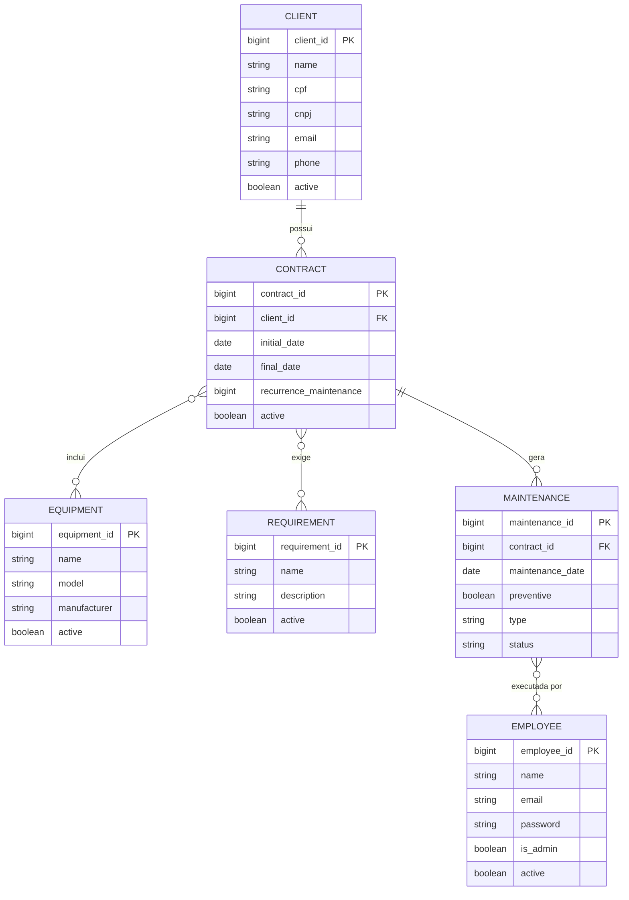
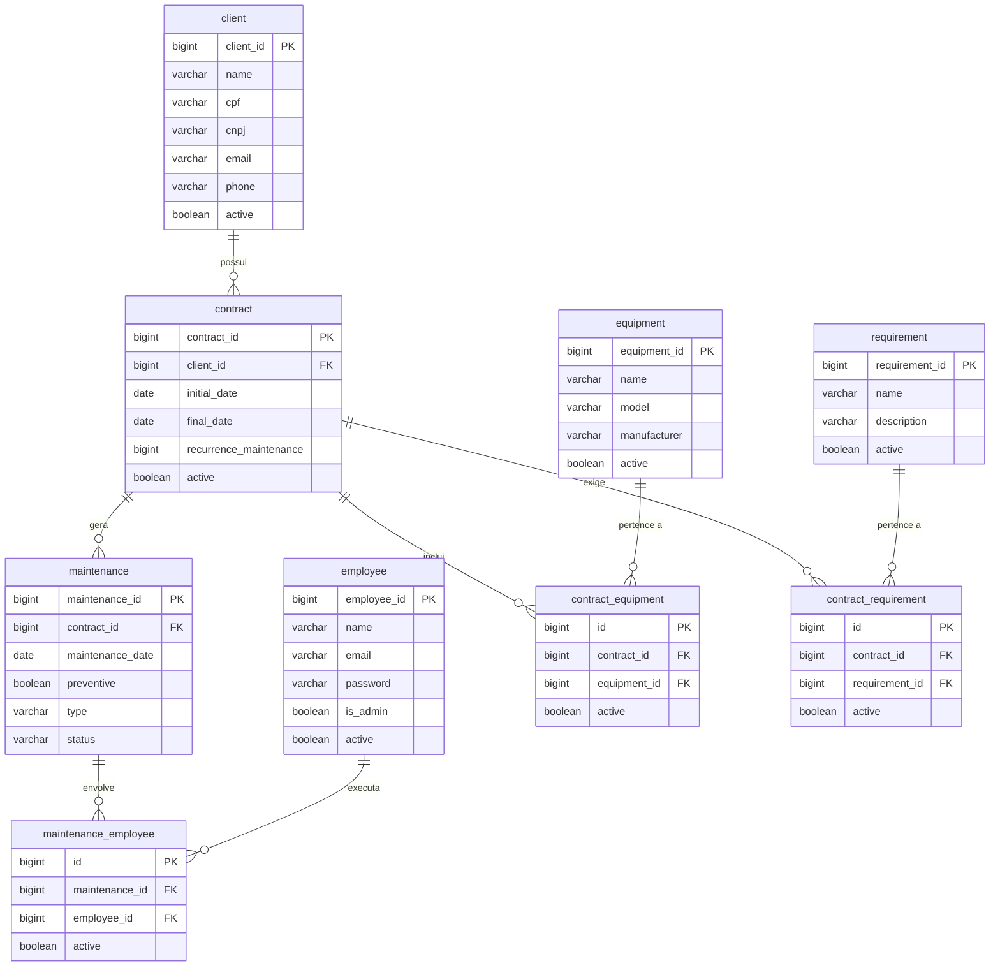

# MER e DER — Banco de Dados Trivio

## MER — Modelo Entidade-Relacionamento

### Entidades e Atributos

#### client
| Atributo | Tipo | Restrições |
|---|---|---|
| **client_id** (PK) | BIGINT | NOT NULL, AUTO |
| name | VARCHAR(100) | NOT NULL |
| cpf | VARCHAR(15) | |
| cnpj | VARCHAR(19) | |
| email | VARCHAR(100) | |
| phone | VARCHAR(20) | |
| active | BOOLEAN | |

#### employee
| Atributo | Tipo | Restrições |
|---|---|---|
| **employee_id** (PK) | BIGINT | NOT NULL, AUTO |
| name | VARCHAR(100) | NOT NULL |
| email | VARCHAR(100) | NOT NULL |
| password | VARCHAR(100) | NOT NULL |
| is_admin | BOOLEAN | |
| active | BOOLEAN | |

#### equipment
| Atributo | Tipo | Restrições |
|---|---|---|
| **equipment_id** (PK) | BIGINT | NOT NULL, AUTO |
| name | VARCHAR(100) | NOT NULL |
| model | VARCHAR(50) | |
| manufacturer | VARCHAR(50) | |
| active | BOOLEAN | |

#### requirement
| Atributo | Tipo | Restrições |
|---|---|---|
| **requirement_id** (PK) | BIGINT | NOT NULL, AUTO |
| name | VARCHAR(100) | NOT NULL |
| description | VARCHAR(255) | |
| active | BOOLEAN | DEFAULT TRUE |

#### contract
| Atributo | Tipo | Restrições |
|---|---|---|
| **contract_id** (PK) | BIGINT | NOT NULL, AUTO |
| client_id (FK) | BIGINT | NOT NULL |
| initial_date | DATE | NOT NULL |
| final_date | DATE | NOT NULL |
| recurrence_maintenance | BIGINT | NOT NULL |
| active | BOOLEAN | DEFAULT TRUE |

#### maintenance
| Atributo | Tipo | Restrições |
|---|---|---|
| **maintenance_id** (PK) | BIGINT | NOT NULL, AUTO |
| contract_id (FK) | BIGINT | NOT NULL |
| maintenance_date | DATE | NOT NULL |
| preventive | BOOLEAN | NOT NULL |
| type | ENUM | NOT NULL (`PREVENTIVA`, `CORRETIVA`, `MELHORIA`) |
| status | ENUM | NOT NULL (`SCHEDULED`, `STARTED`, `COMPLETED`) |

#### contract_equipment _(tabela associativa)_
| Atributo | Tipo | Restrições |
|---|---|---|
| **id** (PK) | BIGINT | NOT NULL, AUTO |
| contract_id (FK) | BIGINT | NOT NULL |
| equipment_id (FK) | BIGINT | NOT NULL |
| active | BOOLEAN | DEFAULT TRUE |

#### contract_requirement _(tabela associativa)_
| Atributo | Tipo | Restrições |
|---|---|---|
| **id** (PK) | BIGINT | NOT NULL, AUTO |
| contract_id (FK) | BIGINT | NOT NULL |
| requirement_id (FK) | BIGINT | NOT NULL |
| active | BOOLEAN | DEFAULT TRUE |

#### maintenance_employee _(tabela associativa)_
| Atributo | Tipo | Restrições |
|---|---|---|
| **id** (PK) | BIGINT | NOT NULL, AUTO |
| maintenance_id (FK) | BIGINT | NOT NULL |
| employee_id (FK) | BIGINT | NOT NULL |
| active | BOOLEAN | DEFAULT TRUE |

---

### Relacionamentos

| Entidade A | Cardinalidade | Entidade B | Descrição |
|---|---|---|---|
| client | 1 : N | contract | Um cliente pode ter muitos contratos |
| contract | N : M | equipment | Um contrato inclui vários equipamentos; um equipamento pode estar em vários contratos (`contract_equipment`) |
| contract | N : M | requirement | Um contrato possui vários requisitos; um requisito pode estar em vários contratos (`contract_requirement`) |
| contract | 1 : N | maintenance | Um contrato pode ter várias manutenções |
| maintenance | N : M | employee | Uma manutenção envolve vários funcionários; um funcionário pode atuar em várias manutenções (`maintenance_employee`) |

---

## DER — Diagrama Entidade-Relacionamento

